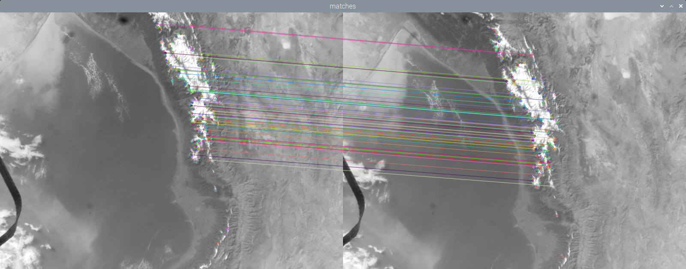

<h2 class="c-project-heading--task">Introduction</h2>

You will use photos taken by an Astro Pi Flight Unit on the International Space Station (ISS) to estimate the speed at which the ISS orbits the Earth.

<h2 class="c-project-heading--explainer">Follow these instructions</h2>

### The European Astro Pi Challenge

The **European Astro Pi Challenge** offers young people the amazing opportunity to conduct scientific investigations in space by writing computer programs that run on Raspberry Pi computers aboard the ISS.

The image below shows two photos taken from the ISS, with lines that connect similar features. By measuring the pixel distance between the features that have moved, you can calculate the speed that the camera was moving, and so work out how fast the ISS is travelling.

## Now run your code

There isn't any code to run yet. Review the example images and make sure you understand what you are going to build before you move on.
