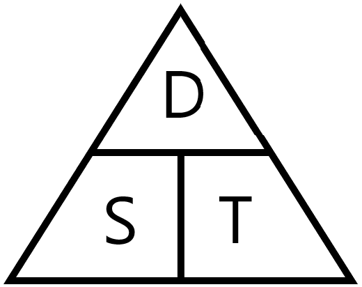

<h2 class="c-project-heading--task">Finding the time difference for two photos</h2>

You can calculate the speed an object is traveling at by dividing the distance it moves by the time it takes to move.

<h2 class="c-project-heading--explainer">Follow these instructions</h2>

So, to calculate the speed of the ISS from photos, you need to know how much time has passed between when the photos were taken.

## Step 1

Remove the call to `print` the results of your `get_time` function.

--- code ---
---
language: python
filename: iss_speed.py
line_numbers: true
line_number_start: 
line_highlights: 13
---
from exif import Image
from datetime import datetime

def get_time(image):
    with open(image, 'rb') as image_file:
        img = Image(image_file)
        time_str = img.get("datetime_original")
        time = datetime.strptime(time_str, '%Y:%m:%d %H:%M:%S')
    return time

--- /code ---

## Step 2

Create a new function called `get_time_difference`. It will take two arguments, which will be the file names of the two images.

--- code ---
---
language: python
filename: iss_speed.py
line_numbers: true
line_number_start: 13
line_highlights: 13
---
def get_time_difference(image_1, image_2):
--- /code ---

## Step 3

Use your `get_time` function to get the times from the Exif data from each of the two images.

--- code ---
---
language: python
filename: iss_speed.py
line_numbers: true
line_number_start: 13
line_highlights: 14-15
---
def get_time_difference(image_1, image_2):
    time_1 = get_time(image_1)
    time_2 = get_time(image_2)
--- /code ---

## Step 4

Subtract the two times from each other, and test it by printing.

--- code ---
---
language: python
filename: issc_speed.py
line_numbers: true
line_number_start: 13
line_highlights: 16-17
---
def get_time_difference(image_1, image_2):
    time_1 = get_time(image_1)
    time_2 = get_time(image_2)
    time_difference = time_2 - time_1
    print(time_difference)
--- /code ---

## Step 5

You can run your function by calling it with two different image names.

--- code ---
---
language: python
filename: iss_speed.py
line_numbers: true
line_number_start: 13
line_highlights: 16-17
---
def get_time_difference(image_1, image_2):
    time_1 = get_time(image_1)
    time_2 = get_time(image_2)
    time_difference = time_2 - time_1
    print(time_difference)

get_time_difference('c', 'atlas_photo_013.jpg')

--- /code ---

## Step 6

Run your code, and if you have used the two images shown above, you should see output like this:

<pre>
>>> 0:00:14
</pre>

## Step 7

The function needs to return the time in seconds, as an integer. The `datetime` package provides an easy conversion for this.

--- code ---
---
language: python
filename: iss_speed.py
line_numbers: true
line_number_start: 13
line_highlights: 17
---
def get_time_difference(image_1, image_2):
    time_1 = get_time(image_1)
    time_2 = get_time(image_2)
    time_difference = time_2 - time_1
    return time_difference.seconds

--- /code ---

## Step 8

To test your code, you can `print` the output of the new function.

--- code ---
---
language: python
filename: iss_speed.py
line_numbers: true
line_number_start: 13
line_highlights: 17
---
def get_time_difference(image_1, image_2):
    time_1 = get_time(image_1)
    time_2 = get_time(image_2)
    time_difference = time_2 - time_1
    return time_difference.seconds

print(get_time_difference('atlas_photo_012.jpg', 'atlas_photo_013.jpg'))
--- /code ---

Your output should look something like this, depending on the photos you have chosen.

<pre>
>>> 14
</pre>

--- save ---

## Now run your code

Run your code and confirm that the time difference between the two photos is printed in seconds.
