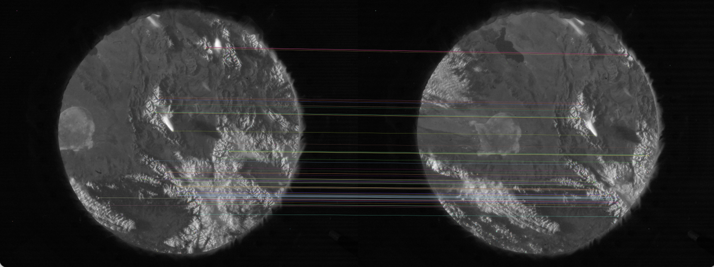

<h2 class="c-project-heading--task">Display matching features</h2>

Matches can be displayed on both images, with lines linking each of the matched keypoints.

<h2 class="c-project-heading--explainer">Follow these instructions</h2>

## Step 1

Delete the final `print` call at the end of your script.

--- code ---
---
language: python
filename: iss_speed.py
line_numbers: true
line_number_start: 46
line_highlights: 49
---
time_difference = get_time_difference(image_1, image_2) # Get time difference between images
image_1_cv, image_2_cv = convert_to_cv(image_1, image_2) # Create OpenCV image objects
keypoints_1, keypoints_2, descriptors_1, descriptors_2 = calculate_features(image_1_cv, image_2_cv, 1000) # Get keypoints and descriptors
matches = calculate_matches(descriptors_1, descriptors_2) # Match descriptors

--- /code ---

## Step 2

Create a function, below your other functions, that takes the two OpenCV image objects, the keypoints, and the matches as arguments.

--- code ---
---
language: python
filename: iss_speed.py
line_numbers: true
line_number_start: 46
line_highlights: 46
---
def display_matches(image_1_cv, keypoints_1, image_2_cv, keypoints_2, matches):

time_difference = get_time_difference(image_1, image_2) # Get time difference between images
image_1_cv, image_2_cv = convert_to_cv(image_1, image_2) # Create OpenCV image objects
keypoints_1, keypoints_2, descriptors_1, descriptors_2 = calculate_features(image_1_cv, image_2_cv, 1000) # Get keypoints and descriptors
matches = calculate_matches(descriptors_1, descriptors_2) # Match descriptors
--- /code ---

## Step 3

Next, draw lines between the keypoints where the descriptors match.

--- code ---
---
language: python
filename: iss_speed.py
line_numbers: true
line_number_start: 46
line_highlights: 47
---
def display_matches(image_1_cv, keypoints_1, image_2_cv, keypoints_2, matches):
    match_img = cv2.drawMatches(image_1_cv, keypoints_1, image_2_cv, keypoints_2, matches[:100], None)
--- /code ---

## Step 4

The images can now be resized and shown, side by side on your screen, with the lines drawn between the matches.

--- code ---
---
language: python
filename: iss_speed.py
line_numbers: true
line_number_start: 46
line_highlights: 48-49
---
def display_matches(image_1_cv, keypoints_1, image_2_cv, keypoints_2, matches):
    match_img = cv2.drawMatches(image_1_cv, keypoints_1, image_2_cv, keypoints_2, matches[:100], None)
    resize = cv2.resize(match_img, (1600,600), interpolation = cv2.INTER_AREA)
    cv2.imshow('matches', resize)

--- /code ---

## Step 5

To finish off the function, the script needs to wait until a key is pressed, and then close the image.

--- code ---
---
language: python
filename: iss_speed.py
line_numbers: true
line_number_start: 46
line_highlights: 50-51
---
def display_matches(image_1_cv, keypoints_1, image_2_cv, keypoints_2, matches):
    match_img = cv2.drawMatches(image_1_cv, keypoints_1, image_2_cv, keypoints_2, matches[:100], None)
    resize = cv2.resize(match_img, (1600,600), interpolation = cv2.INTER_AREA)
    cv2.imshow('matches', resize)
    cv2.waitKey(0)
    cv2.destroyWindow('matches')
--- /code ---

## Step 6

All these functions now need to be called in order, so that you can see the output.

At the bottom of your script, add the following lines:

--- code ---
---
language: python
filename: iss_speed.py
line_numbers: false
line_number_start: 54
line_highlights: 59
---
time_difference = get_time_difference(image_1, image_2) # Get time difference between images
image_1_cv, image_2_cv = convert_to_cv(image_1, image_2) # Create OpenCV image objects
keypoints_1, keypoints_2, descriptors_1, descriptors_2 = calculate_features(image_1_cv, image_2_cv, 1000) # Get keypoints and descriptors
matches = calculate_matches(descriptors_1, descriptors_2) # Match descriptors
display_matches(image_1_cv, keypoints_1, image_2_cv, keypoints_2, matches) # Display matches
--- /code ---

--- save ---

## Now run your code

Run your code and you should see an image like the one below. Click in the window and press any key to exit the image view.

